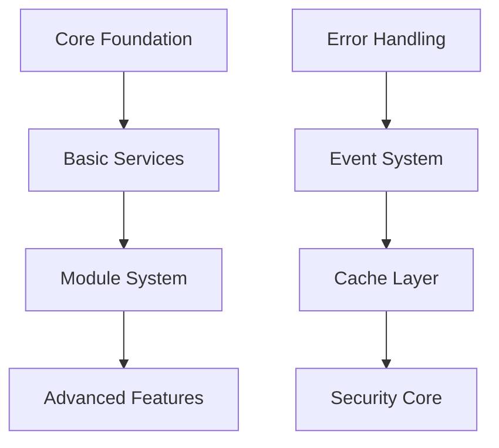

# CMS Project Strategic Control Framework

## 1. Strategic Alignment Protocol

### Core Principles
```yaml
project_type: Enterprise Laravel CMS
architecture: Modular Monolith
base_framework: Laravel 10+
coding_standards: PSR-12
design_principles: SOLID
```

### Phase Gates
Each implementation must pass through sequential phase gates:

1. **Strategic Alignment Gate**
   - Validates phase-appropriate implementation
   - Ensures prerequisite components exist
   - Confirms architectural compliance

2. **Dependency Validation Gate**
   - Verifies core dependencies are complete
   - Checks for circular dependencies
   - Validates service boundaries

3. **Quality Assurance Gate**
   - Enforces coding standards
   - Validates documentation
   - Ensures test coverage

## 2. Implementation Sequencing

### Mandatory Sequence


### Component Dependencies
```yaml
components:
  error_handling:
    priority: 1
    required_for: ["all"]
  event_system:
    priority: 2
    required_for: ["services", "modules"]
  caching:
    priority: 3
    required_for: ["performance", "scaling"]
```

## 3. Strategic Deviation Prevention

### Pre-Implementation Checklist
- [ ] Phase alignment verified
- [ ] Dependencies validated
- [ ] Core requirements met
- [ ] Documentation prepared
- [ ] Tests planned
- [ ] Security considerations addressed

### Implementation Rules
1. No forward dependencies allowed
2. Core components must be complete before modules
3. Each feature must have clear strategic alignment
4. No experimental features without approval
5. All implementations must follow established patterns

## 4. Quality Control Mechanisms

### Code Quality Requirements
```yaml
requirements:
  test_coverage: minimum 80%
  complexity: maximum 10
  method_length: maximum 20 lines
  class_length: maximum 200 lines
  documentation: mandatory
```

### Performance Standards
```yaml
standards:
  page_load: < 200ms
  api_response: < 100ms
  database_query: < 50ms
  cache_hit_ratio: > 90%
```

## 5. Strategic Recovery Procedures

When deviation is detected:

1. **Immediate Actions**
   - Halt related development
   - Document deviation
   - Assess impact

2. **Recovery Steps**
   - Create correction plan
   - Implement fixes
   - Update prevention measures
   - Validate results

3. **Learning Integration**
   - Update strategic controls
   - Enhance validation rules
   - Document lessons learned

## 6. Implementation Instructions

All implementations MUST:

1. **Begin With Strategy Check**
   ```php
   // Before any implementation:
   validateStrategicAlignment();
   validateDependencies();
   validatePhaseRequirements();
   ```

2. **Follow Core Patterns**
   ```php
   // Repository Pattern
   class ExampleRepository extends BaseRepository
   {
       // Always implement core interfaces
       // Always include proper error handling
       // Always document public methods
   }
   ```

3. **Maintain Service Boundaries**
   ```php
   // Service Layer
   class ExampleService
   {
       // Clear service boundaries
       // Proper dependency injection
       // Transaction management
   }
   ```

## 7. Decision Making Framework

For each implementation decision:

1. **Strategic Questions**
   - Does this belong in current phase?
   - Are all dependencies satisfied?
   - Will this create technical debt?
   - Is this the optimal solution?

2. **Implementation Questions**
   - Follows established patterns?
   - Properly documented?
   - Adequately tested?
   - Performance implications?

## 8. Continuous Alignment

### Monitoring Points
1. Phase progression
2. Dependency management
3. Code quality metrics
4. Performance indicators
5. Technical debt assessment

### Correction Triggers
1. Pattern deviations
2. Performance degradation
3. Quality metric failures
4. Security concerns
5. Scalability issues

## 9. Strategic Commands

The system MUST:

1. Reject implementations that:
   - Skip phases
   - Ignore dependencies
   - Break patterns
   - Lack documentation
   - Miss tests

2. Enforce:
   - Proper sequencing
   - Pattern compliance
   - Quality standards
   - Security measures
   - Performance requirements

## 10. Final Validation

Before any code is accepted:

```yaml
validate:
  strategic_alignment: mandatory
  phase_compliance: mandatory
  dependency_check: mandatory
  quality_metrics: mandatory
  documentation: mandatory
  tests: mandatory
```

This framework serves as the foundational guide for all development decisions and implementations in the CMS project. Any deviation from these guidelines must be explicitly justified and approved.
