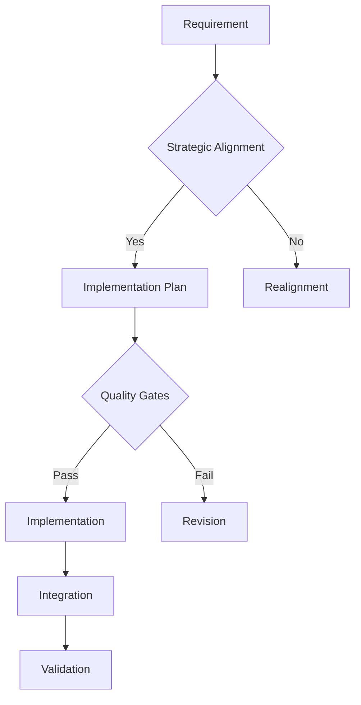

# CMS Project Strategic Implementation Framework

## Core Principles

### 1. Strategic Alignment Validation
Every code implementation must pass through the following validation gates:

```
GATE 1: Foundation Alignment
- Does this code belong to the current phase?
- Are all prerequisites implemented?
- Does it follow the established patterns?

GATE 2: Dependency Check
- Are required core components complete?
- Will this create future technical debt?
- Does it maintain proper layering?

GATE 3: Quality Assurance
- Follows SOLID principles
- Maintains PSR-12 standards
- Includes proper error handling
- Has necessary tests
```

### 2. Phase Implementation Rules

#### Phase 1: Foundation (CURRENT PRIORITY)
- No module implementation until core is complete
- No advanced features until foundation is stable
- Core services must be implemented in order:
  1. Exception handling
  2. Logging
  3. Configuration
  4. Event system
  5. Cache abstraction
  6. Database foundations

#### Phase 2: Module System
- Cannot begin until Phase 1 is 100% complete
- Must follow strict dependency ordering
- Each module must be self-contained

#### Phase 3: Advanced Features
- Requires both Phase 1 and 2 completion
- Features must be implemented in priority order
- No experimental features without approval

### 3. Recovery Protocol

When deviation is detected:

1. Identify affected components
2. Assess impact severity
3. Choose correction strategy:
   - Immediate rewrite if blocking
   - Scheduled refactor if non-blocking
   - Partial adaptation if minimal impact

### 4. Implementation Checklist

Before any code implementation:

```
□ Phase alignment verified
□ Dependencies checked
□ Core requirements met
□ No forward dependencies
□ Follows established patterns
□ Properly documented
□ Tests included
□ Error handling complete
```

### 5. Strategic Correction Plan

For current deviations:

1. Core Components (IMMEDIATE ACTION)
```
Priority 1: Missing Foundation Components
- Exception handling system
- Event dispatcher
- Logging infrastructure
- Cache abstraction

Action: Implement these before any new features
```

2. Premature Implementations (SCHEDULED CORRECTION)
```
ModuleRepository -> Flag for refactor
TemplateService -> Schedule for reconstruction
```

3. Architectural Alignment (CONTINUOUS)
```
- Review all service implementations
- Validate repository patterns
- Ensure proper layering
```

### 6. Quality Gates

Every implementation must pass:

```
GATE 1: Strategic Alignment
GATE 2: Architectural Compliance
GATE 3: Code Quality
GATE 4: Test Coverage
GATE 5: Documentation
```

### 7. Development Workflow



## Implementation Priorities

### Immediate Actions (Next 48 Hours)
1. Implement missing core components
2. Stabilize foundation layer
3. Document all deviations

### Short Term (Week 1)
1. Complete base infrastructure
2. Implement logging system
3. Enhance error handling

### Medium Term (Week 2-3)
1. Refactor premature implementations
2. Strengthen core services
3. Complete foundation phase

## Strategic Validation Rules

All code must:
1. Belong to current phase
2. Have no forward dependencies
3. Follow established patterns
4. Include complete documentation
5. Pass all quality gates

## Error Prevention Mechanism

1. Pre-implementation validation
2. Continuous alignment checking
3. Regular strategic reviews
4. Automated compliance testing
5. Documentation requirements

## Recovery Procedures

When deviation occurs:
1. Halt new development
2. Assess impact
3. Create correction plan
4. Implement fixes
5. Validate results
6. Update prevention measures

